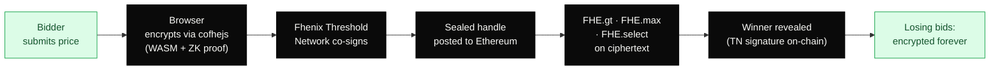
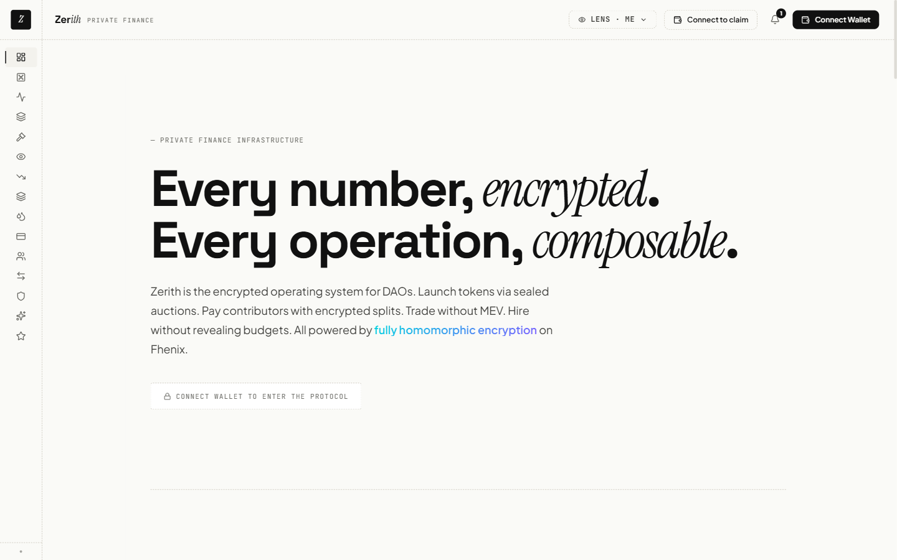
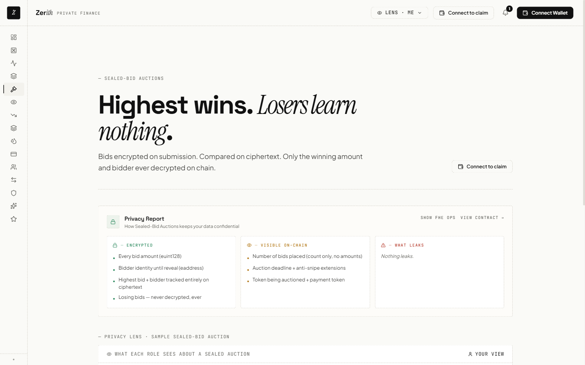
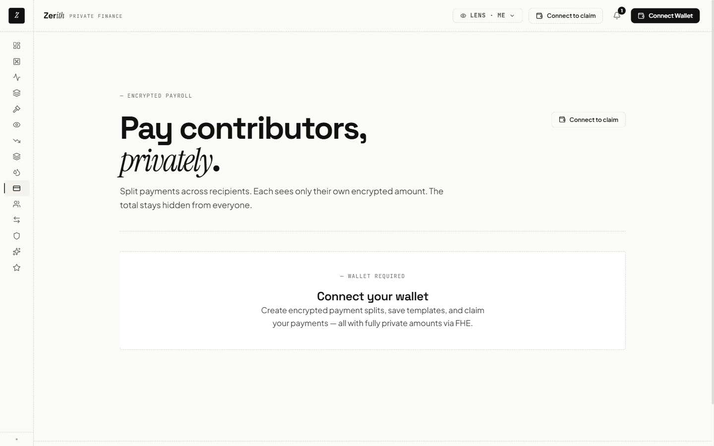
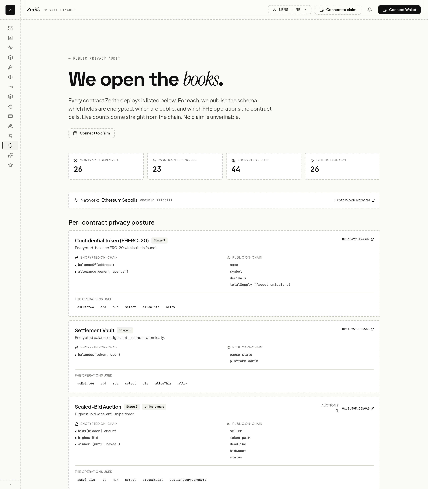

<div align="center">

<h1>Zerith</h1>

### Sell your treasury without leaking it.

**Encrypted block sales for token foundations — built on Fhenix Fully Homomorphic Encryption.**
Bidders compete with sealed prices, the chain clears a fair settlement, and losing bids stay encrypted on Ethereum *forever* — independently re-verifiable by anyone with an Etherscan link.

<br/>

[](https://sepolia.etherscan.io/address/0xdEe59FD1d8Ac071146c7ED012a0a343FdD56b0A0)
[](https://fhenix.io)
[](#-deployed-contracts)
[](./test)
[](./PHASE-2-VERIFICATION-LOG.md)
[](https://zerith-fi.vercel.app/audit)
[](./LICENSE)

<br/>

**[▶ Live App](https://zerith-fi.vercel.app)** &nbsp;·&nbsp; **[⚡ Interactive Quickstart](https://zerith-fi.vercel.app/quickstart)** &nbsp;·&nbsp; **[📖 Docs](https://zerith-fi.vercel.app/docs)** &nbsp;·&nbsp; **[🔍 On-chain Proof](https://sepolia.etherscan.io/tx/0x98a1c650b8f992dacba8580ac25aa1c1960bde1d37fa490697a9a143014fafc7)**

</div>

---

> [!NOTE]
> **The 30-second proof.** Zerith's headline claim — *"losing bids in a sealed auction stay encrypted forever, even from us"* — is a single public transaction. Three bidders bid `500 / 800 / 1200` CDEX (all encrypted); the winner reveals as `1200`; the two losing bids remain undecryptable ciphertext handles on-chain, never `FHE.allowGlobal`'d.
> **Inspect it yourself, no account required → [`0x98a1c650…fafc7`](https://sepolia.etherscan.io/tx/0x98a1c650b8f992dacba8580ac25aa1c1960bde1d37fa490697a9a143014fafc7)**

---

## Table of Contents

- [Overview](#overview)
- [How It Works](#how-it-works)
- [Features](#features)
- [Live Preview](#live-preview)
- [Quick Start](#quick-start)
- [Verify On-Chain](#verify-on-chain)
- [Tech Stack](#tech-stack)
- [Repository Structure](#repository-structure)
- [By the Numbers](#by-the-numbers)
- [Deployed Contracts](#-deployed-contracts)
- [Roadmap](#roadmap)
- [Documentation](#documentation)
- [Security & Disclosures](#security--disclosures)
- [Contributing](#contributing)
- [License & Contact](#license--contact)

---

## Overview

Public chains broadcast every number. A "sealed" bid on Ethereum is not actually sealed — a foundation's reserve price isn't reserved, and a bidder's competitor sees every counter-quote in the mempool before it confirms. For finance that *requires* confidentiality, a transparent ledger is a structural liability, not a feature.

Token foundations sit on **tens of billions in concentrated DAO treasury positions** (DeepDAO tracks well over **$10B** across the largest treasuries, much held as a single native token). Every public token sale by Optimism, dYdX, Polygon and others has measurably moved its own price during execution — typically **5–20%** of notional bled to MEV searchers who watched the order flow land.

**Zerith fixes the structural problem with Fully Homomorphic Encryption.** Bids, prices, counter-quotes, treasury balances, payroll amounts — all encrypted client-side, processed on-chain *as ciphertext* via Fhenix's CoFHE coprocessor, and settled with one revealed result and zero leaked detail. The same primitive that hides a winning auction bid hides a salary, a balance, an OTC quote, or a multisig threshold.

The receipt is on Etherscan. The mechanism is in the contract. The privacy claim is **enforceable today by anyone with a block explorer.**

**Who it's for** — the finance lead at a token foundation diversifying their treasury; the market maker bidding on a block sale; the DAO operations manager running encrypted payroll across 50 contributors. Anyone whose work demands settlement on a public chain *and* confidentiality of the numbers.

---

## How It Works

Every encrypted feature in Zerith collapses to the same five-step chain. Step 4 — computing on ciphertext — is what makes *"losing bids stay encrypted forever"* enforceable on-chain rather than a marketing line.



`encrypt client-side → TN co-sign → submit ciphertext → FHE compute → reveal only the winning result`

The plaintext never leaves the user's browser. The chain runs `FHE.gt / max / select` on encrypted handles without ever materializing the values. A reveal can't be faked by a single party — operator quorum on the Threshold Network is enforced and verified on-chain.

---

## Features

**5 auction mechanisms** and **8 DAO-finance primitives**, all encrypted end-to-end, all live on Ethereum Sepolia.

| Encrypted block sales | What stays private |
|---|---|
| **Sealed-bid** ★ headline | Every losing bid, forever |
| **Vickrey** (second-price) | All bids; only the clearing price reveals |
| **Dutch** (declining price) | Each buyer's purchase amount |
| **Batch** (uniform clearing) | Every order until the clearing price is set |
| **Overflow** (pro-rata) | Each commitment during the sale |

| DAO-finance primitive | What stays private |
|---|---|
| **Treasury** vault + Proof-of-Reserves | Balances — prove `≥ X` without revealing the number |
| **Encrypted Payments / Payroll** | Per-recipient amounts; each decrypts only their own |
| **OTC Desk** (request → quote → accept) | Both sides' price bands until match |
| **Encrypted Streaming** | The per-second rate |
| **Confidential Multisig** | The proposal amount until execution |
| **Organization** (DAO voting) | Encrypted tally |
| **OrderBook / Limit orders** | Limit prices — no price-based front-running |
| **Allowlist Gate** | Membership, via Merkle proof |

> **Product focus.** The primary navigation surfaces the wedge (Block Sales) plus the trust pages (Treasury, Audit). Everything else is reachable from `/more`, clearly labeled, so breadth never dilutes the core story for a first-time visitor.

---

## Live Preview

| Landing | Sealed auction · Privacy Report |
|:---:|:---:|
|  |  |
| **Encrypted payroll** | **Cross-contract privacy audit** |
|  |  |

<sub>Captured live from <https://zerith-fi.vercel.app>. Full mobile + desktop sweep (40 PNGs) in [`verification-evidence/`](./verification-evidence/).</sub>

---

## Quick Start

You don't need to install anything to verify the core claim — pick the path that fits.

### ⚡ Try it live (no install, no MetaMask, ~3 min)

Open **[zerith-fi.vercel.app/quickstart](https://zerith-fi.vercel.app/quickstart)**. Five guided steps, each a *real* on-chain action: spin up a one-click burner wallet, claim test tokens, place an encrypted bid on a live sealed auction, unseal your own bid via permit, and toggle the Privacy Lens to see what an outside observer sees instead. Progress persists locally, so you can leave and resume.

This is the fastest way to *feel* FHE working before reading any code.

<details>
<summary><b>🛠 Clone & run the full proof locally (~5 min)</b></summary>

**Prerequisites:** Node `v20.x` or `v22.x`, npm `10.x`.

```bash
# 1 · Clone + install
git clone https://github.com/Ritik200238/zerith.git && cd zerith
npm install
cp .env.example .env
# Fill: PRIVATE_KEY (any Sepolia-funded wallet), SEPOLIA_RPC_URL

# 2 · Compile + run the full test suite (400+ unit tests across 20 suites)
npm run compile
npm test

# 3 · Confirm all 26 deployed contracts respond on Sepolia
npx hardhat run tasks/launch-day-check.ts --network ethSepolia

# 4 · Run the headline sealed-auction e2e from a fresh funded burner
npx hardhat run tasks/create-burner.ts        --network ethSepolia
npx hardhat run tasks/verify-auction-e2e.ts   --network ethSepolia
#  → 3 burners bid 500/800/1200 · close · reveal winner · losing bids encrypted forever
```

**Run the frontend locally:**

```bash
cd frontend && npm install
cp .env.example .env.local
# Fill: BURNER_FUNDER_PRIVATE_KEY (hot wallet that funds demo burners), SEPOLIA_RPC_URL
npm run dev          # → http://localhost:3000
```

**Deploy your own copy (optional):**

```bash
npm run deploy:sepolia              # deploys all 26 contracts
npx hardhat run tasks/seed-state.ts --network ethSepolia
cd frontend && npm run copy-abis    # syncs ABIs from /artifacts → frontend
```

</details>

---

## Verify On-Chain

> Every transaction below is a **real Sepolia receipt** captured at submission time. No mocks. Verifying a receipt on Etherscan costs you nothing — no account, no wallet, no Zerith server.

The headline claim as one inspectable transaction:

```
Sealed auction · 3 bidders bid 500 / 800 / 1200 CDEX (all encrypted)
revealWinner tx → 0x98a1c650…fafc7
Winner revealed: 1200 — exactly what bidder 3 bid.
Losing bids:     still-encrypted handles in bids[0][bidder1/bidder2] on-chain,
                 never FHE.allowGlobal'd → undecryptable forever.
```

[**Open the headline tx on Sepolia Etherscan →**](https://sepolia.etherscan.io/tx/0x98a1c650b8f992dacba8580ac25aa1c1960bde1d37fa490697a9a143014fafc7)

<details>
<summary><b>📑 Full reviewer replay path — every feature, every receipt</b></summary>

| Want to see | Open this |
|---|---|
| **Sealed auction · losers stay encrypted forever (THE claim)** | [`0x98a1c650…fafc7`](https://sepolia.etherscan.io/tx/0x98a1c650b8f992dacba8580ac25aa1c1960bde1d37fa490697a9a143014fafc7) |
| **Payroll · 3 recipients, each decrypts only own amount, TN rejects cross-account** | [b1](https://sepolia.etherscan.io/tx/0x2726bcdfaca0e1c317a54e67d9422c4e350db5d795b4111234174245f3493aa8) · [b2](https://sepolia.etherscan.io/tx/0x9cc8b738798b1a70791204e8af3c0da2ea9909a7b156120eeb38f572793a7e90) · [b3](https://sepolia.etherscan.io/tx/0x8484a69cfa21e0ffdd1542f9502c59f574a7741c153dcd30d924d9afd00f3645) |
| **OTC request → quote → accept (status → MATCHED)** | [accept tx](https://sepolia.etherscan.io/tx/0xd01b26f634b505af6ad6bebaa6f66bba4287a02549a6dcb0eb2a06eeb3ac4900) |
| **Vickrey second-price · encrypted bid posted** | [`0x9642ec83…`](https://sepolia.etherscan.io/tx/0x9642ec8320706020099a822503fdfd5a1980a5ab15b659b0b6be389c601fb5a4) |
| **Dutch · encrypted purchase at decayed price** | [`0xa72a2bfd…`](https://sepolia.etherscan.io/tx/0xa72a2bfd02dd5f5970745f527f86756238e3ee511ddd1432ea78a74665ee4b27) |
| **Batch · encrypted buyOrder, FHE clearing price** | [`0x44414962…`](https://sepolia.etherscan.io/tx/0x44414962eb5ae9cb1e7006def376e3db931296f16372c47060d3760d2aac0028) |
| **Overflow · encrypted commitment, pro-rata when over** | [`0xe112e977…`](https://sepolia.etherscan.io/tx/0xe112e97732d297581fd0c664a012f87b0be2824a6fe66f04e3332b0430f69cd4) |
| **Treasury · vault deposit (FHE.allowTransient fix)** | [`0x44f7b79b…`](https://sepolia.etherscan.io/tx/0x44f7b79bb6731dc3170cf81ebcac4d09e07f294f366e864fcc7b2370116f392a) |
| **Treasury · withdraw (zero-replacement guard)** | [`0xad53c0ac…`](https://sepolia.etherscan.io/tx/0xad53c0aca9f6eeb66a6181c39ad9634e6e15c5794e7b4b469fa93e52e4ee1df8) |
| **Proof-of-Reserves · cross-contract FHE.gte vs threshold** | [`0xec68150d…`](https://sepolia.etherscan.io/tx/0xec68150defc17ff9446e0ae27c7b29c490860b1e7fc6a52c918f964c2a7fbd59) |
| **Encrypted streaming · rate handle stored** | [`0xef4f35ea…`](https://sepolia.etherscan.io/tx/0xef4f35ea5e80301b1cca424aded0a9f2e0f3db868dfdd5c3c4dd2ff5254ebf11) |
| **Confidential multisig · encrypted threshold** | [`0x6346c75d…`](https://sepolia.etherscan.io/tx/0x6346c75db9d9ecb00ca27a10976638b64e6fce4e07c596fbbeb14060ff5ae604) |
| **Freelance · 2 encrypted bids, FHE.lt picks lowest** | [post tx](https://sepolia.etherscan.io/tx/0x58647a9945b06484dd322e6ca48c3f1f6681b3700fe46745af2a7b77da098b94) |
| **Org + OrderBook + AllowlistGate** | [orderbook](https://sepolia.etherscan.io/tx/0xe5fa5bb756e05d65aaf9840eea9e565a6cf56913a81447d661ac133b8ea0c1a1) |
| Burner that submitted everything above | [`0x492a…a3e0`](https://sepolia.etherscan.io/address/0x492aaF98150f0542dD8D7F5Df1bE98265809a3e0) |
| Full verification log (34 txs) | [PHASE-2-VERIFICATION-LOG.md](./PHASE-2-VERIFICATION-LOG.md) |

</details>

---

## Tech Stack

| Layer | Technology |
|---|---|
| **Encryption** | [Fhenix CoFHE](https://fhenix.io) coprocessor · `@fhenixprotocol/cofhe-contracts` · Threshold Network |
| **Client SDK** | `@cofhe/sdk` + `cofhejs` (WASM + ZK proof, browser-side encryption) |
| **Contracts** | Solidity `^0.8.x` · Hardhat · OpenZeppelin · `fhenix-confidential-contracts` (FHERC-20) |
| **Frontend** | Next.js 16 (App Router) · React 19 · TypeScript · Tailwind · ethers v6 |
| **Wallets** | Reown AppKit (MetaMask, WalletConnect, Coinbase, 300+ mobile) + embedded burner |
| **SDK package** | `@zerith/sdk` — typed client (`packages/sdk`) |
| **Network** | Ethereum Sepolia (live) · Arbitrum Sepolia (queued for v1.1) |
| **Hosting** | Vercel |

---

## Repository Structure

```
zerith/
├── contracts/              # Solidity sources (32 files)
│   ├── core/               #   token, vault, registry, claim NFT, vesting, referrals
│   ├── features/           #   5 auctions + 8 DAO-finance primitives
│   ├── interfaces/         #   shared interfaces
│   └── libraries/          #   FHE constants + helpers
├── test/unit/              # 400+ Hardhat unit tests across 20 suites
├── tasks/                  # deploy + e2e-verification + seeding scripts
├── packages/sdk/           # @zerith/sdk — typed TypeScript client
├── frontend/               # Next.js 16 app (zerith-fi.vercel.app)
│   └── src/
│       ├── app/            #   28 routes (auctions, treasury, payments, …)
│       ├── components/     #   PrivacyLens, TxFlowDrawer, shared UI
│       ├── hooks/          #   useEncrypt, useUnseal, useContract, …
│       ├── providers/      #   wallet + Fhenix SDK contexts
│       └── lib/            #   ABIs, contract addresses, privacy schema
├── deployed-addresses.json # source of truth for every live contract
└── verification-evidence/  # 40 screenshots + on-chain proof captures
```

---

## By the Numbers

<sub>Refreshed **2026-05-30** against the live chain and the repo.</sub>

| Metric | Value | Where to look |
|---|---|---|
| Contracts deployed (Ethereum Sepolia) | **26** addresses (incl. 1 `MockToken` test-pair ERC-20) | [`deployed-addresses.json`](./deployed-addresses.json) |
| Solidity sources | **32** files (incl. interfaces + libraries) | `contracts/**/*.sol` |
| Unit tests | **400+** `it()` cases across **20** suites | [`test/unit/`](./test/unit/) |
| Test coverage | **20 of 27** product contracts; the 7 newest primitives are E2E-verified on Sepolia, unit tests in progress | [`test/unit/`](./test/unit/) |
| End-to-end Sepolia transactions verified | **34** | [PHASE-2-VERIFICATION-LOG.md](./PHASE-2-VERIFICATION-LOG.md) |
| Distinct FHE operations used | **26** | live-counted on [`/audit`](https://zerith-fi.vercel.app/audit) |
| Auction mechanisms | **5** (Sealed · Vickrey · Dutch · Batch · Overflow) | `contracts/features/` |
| DAO-finance primitives | **8** | `contracts/features/` |
| Frontend routes (mobile-clean) | **28** | [`verification-evidence/mobile/`](./verification-evidence/mobile/) |
| Onboarding time (Try Instantly → first bid) | **~5 seconds** | embedded burner + faucet |
| Networks | Sepolia (live) · Arbitrum Sepolia (queued) | chainIds `11155111` + `421614` |

---

## 📜 Deployed Contracts

**Ethereum Sepolia · chainId `11155111`** — 26 addresses deployed **2026-05-18** with the vault ACL fix (`FHE.allowTransient(amount, token)` before `confidentialTransferFrom`). One of the 26 is `MockToken`, a plain ERC-20 used only as the second leg of a trading pair in tests — so the product surface is **25 contracts here, plus 2 carry-overs** below. Full address book: [`deployed-addresses.json`](./deployed-addresses.json).

<details>
<summary><b>View all 26 contract addresses</b></summary>

| Contract | Address |
|---|---|
| `ConfidentialToken` (CDEX, 6 decimals, faucet) | [`0x56047782…12a3d2`](https://sepolia.etherscan.io/address/0x56047782ABFE56d88f1f29b12b3c0C22ee12a3d2) |
| `PlatformRegistry` | [`0x0a97e158…C5F5A8`](https://sepolia.etherscan.io/address/0x0a97e158D0679A29321AB97A54AF666269C5F5A8) |
| `SettlementVault` | [`0x31B75102…D655a5`](https://sepolia.etherscan.io/address/0x31B751027Ed82b489f42212371d17e30c4D655a5) |
| `SealedAuction` ★ headline | [`0xdEe59FD1…56b0A0`](https://sepolia.etherscan.io/address/0xdEe59FD1d8Ac071146c7ED012a0a343FdD56b0A0) |
| `VickreyAuction` | [`0x12973Ac8…D54e17`](https://sepolia.etherscan.io/address/0x12973Ac885A11136A9f948beCc6e810CF9D54e17) |
| `DutchAuction` | [`0xd9bA4b7b…B65b54`](https://sepolia.etherscan.io/address/0xd9bA4b7b825f3558757Fe977d024b29e27B65b54) |
| `BatchAuction` | [`0xB29AF471…fBEfd5`](https://sepolia.etherscan.io/address/0xB29AF471E9392D0bAafc898795d7Ed6Bd6fBEfd5) |
| `OverflowSale` | [`0x91b869Ba…034Adb`](https://sepolia.etherscan.io/address/0x91b869Ba4Ad80683be67e7F2f776fFf655034Adb) |
| `AuctionClaim` | [`0xD46b298b…876f65c`](https://sepolia.etherscan.io/address/0xD46b298b4c4ce04E65b37a7F594D8C8e7876f65c) |
| `PrivatePayments` | [`0x15309001…712b4B`](https://sepolia.etherscan.io/address/0x15309001612f1667C2Fc1De2107769F438712b4B) |
| `OTCBoard` | [`0x808C27D1…4Cdb3D`](https://sepolia.etherscan.io/address/0x808C27D12265234bE405Eb45800f2BDB1f4Cdb3D) |
| `EncryptedStreaming` | [`0xa3076EF9…F938De`](https://sepolia.etherscan.io/address/0xa3076EF9395E2D7F81d9FB79Cd3E984449F938De) |
| `ConfidentialMultisig` | [`0x72501466…be28d36`](https://sepolia.etherscan.io/address/0x7250146635a9E0b60471037D6C7c51b21be28d36) |
| `Organization` | [`0x088356c0…7EC1DF`](https://sepolia.etherscan.io/address/0x088356c0ab2035605422f8B4Da2d4037487EC1DF) |
| `OrderBook` | [`0x80b09409…2D45E2`](https://sepolia.etherscan.io/address/0x80b09409f2dB5FAEb45f2ca36C8C1b06772D45E2) |
| `LimitOrderEngine` | [`0x09A01EFA…58F8E6`](https://sepolia.etherscan.io/address/0x09A01EFA1e97c9f12F1Aa6Dc0dAf1b019a58F8E6) |
| `FreelanceBidding` | [`0xf71715fD…22d5CE05`](https://sepolia.etherscan.io/address/0xf71715fD9c9d314D56FBa0031EBc69ba22d5CE05) |
| `Escrow` | [`0x36dbcCAF…4f36d32`](https://sepolia.etherscan.io/address/0x36dbcCAF465f106ebB3da7E9776b0598d4f36d32) |
| `AllowlistGate` | [`0xa9d8DA5D…9c0EE4`](https://sepolia.etherscan.io/address/0xa9d8DA5D2878E8261A1f9c2c53dCA21e849c0EE4) |
| `TokenVesting` | [`0x1be9DF85…00E4895`](https://sepolia.etherscan.io/address/0x1be9DF85c8cd48b98f7F0Cc75F565225f00E4895) |
| `EncryptedRoyalty` | [`0xD3AD7038…2DbF32`](https://sepolia.etherscan.io/address/0xD3AD70382cEcFdF291c060eE1fA17aE4Eb2DbF32) |
| `Referrals` | [`0x77ef9736…48af13`](https://sepolia.etherscan.io/address/0x77ef973642CC1BAE0756D20E25c83d5b5148af13) |
| `Reputation` | [`0xcbD4c526…58Ac09`](https://sepolia.etherscan.io/address/0xcbD4c5269219f3eE8a1C3Dbe0FB24d1F6558Ac09) |
| `PortfolioTracker` | [`0xe72F751B…3bc47a0`](https://sepolia.etherscan.io/address/0xe72F751B9FB60C542e352F82826f465FD3bc47a0) |
| `ProofOfReserves` | [`0xFA609253…03bd70`](https://sepolia.etherscan.io/address/0xFA609253c0CA0297e8c272543EE806CAC203bd70) |
| `MockToken` (test-pair ERC-20, not a product contract) | [`0x949caC21…d1A672`](https://sepolia.etherscan.io/address/0x949caC2113c0AF90b309Ec1A9136f7B159d1A672) |

**Carry-overs** from the prior deploy (unaffected by the vault fix):

| Contract | Address | Note |
|---|---|---|
| `ConfidentialWrapper` | [`0x7Cb51509…2420Df42`](https://sepolia.etherscan.io/address/0x7Cb515093392Af34cF14c654dbA666422420Df42) | points at the new token via constructor arg |
| `EncryptedRaffle` | [`0xEADb4957…18Af1b1`](https://sepolia.etherscan.io/address/0xEADb49571BCA5188d9AEe0DB7b7154eD118Af1b1) | doesn't touch the vault |

</details>

---

## Roadmap

### ✅ Shipped on Ethereum Sepolia

- **26 deployed contracts** — every address in [`deployed-addresses.json`](./deployed-addresses.json), redeployed 2026-05-18 with the vault ACL fix.
- **5 auction mechanisms** (Sealed, Vickrey, Dutch, Batch, Overflow) — each with a verified e2e tx.
- **8 DAO-finance primitives** (Treasury, Payments, OTC, Streaming, Multisig, Organization, OrderBook, AllowlistGate).
- **Embedded burner wallet** — `/api/burner/create` generates + funds a fresh burner in ~5 seconds; no MetaMask required.
- **Multi-wallet** — Reown AppKit (MetaMask, WalletConnect QR, Coinbase, 300+ mobile wallets).
- **TxFlowDrawer** — a 4-step state machine (encrypt → submit → confirm → sealed) that makes FHE latency feel intentional.
- **Privacy Lens** — every page renders from three perspectives (me · counterparty · observer), default-on.
- **400+ Hardhat unit tests** across 20 contract suites — covering 20 of 27 product contracts; the 7 newest are E2E-verified on Sepolia with unit tests in progress.
- **34 end-to-end Sepolia transactions** verified through real burner wallets.

### 🔭 Queued for v1.1 → mainnet

- **Arbitrum Sepolia deployment** — same contracts, redeploy script ready (`npm run deploy:arb-sepolia`).
- **USDC settlement** — foundations sell tokens for stables; adding USDC as a payment token behind a whitelist.
- **Institutional KYC gate** — per-auction allowlist via Coinbase Verified Onchain / Privado ID.
- **Safe-multisig protocol ownership** — single-deployer today; pre-mainnet move to 2-of-3 Safe.
- **Formal security audit** — conversations started with leading audit firms (6–10 week lead time).
- **First foundation design-partner pilot** — real treasury slice, real case study.

> These are not pretended-done. They are the honest work between *shippable testnet protocol* and *mainnet revenue*. See [`KNOWN-ISSUES.md`](./KNOWN-ISSUES.md) and [`CONTRACT-REDEPLOY-DECISIONS.md`](./CONTRACT-REDEPLOY-DECISIONS.md) for the full disclosed gap list.

---

## Documentation

| Doc | Purpose |
|---|---|
| [Docs site](https://zerith-fi.vercel.app/docs) | SDK reference · sealed-auction lifecycle · threat model · verification recipe |
| [LAUNCH-QA-RESULTS.md](./LAUNCH-QA-RESULTS.md) | Canonical launch QA — every claim mapped to a tx hash |
| [PHASE-2-VERIFICATION-LOG.md](./PHASE-2-VERIFICATION-LOG.md) | All 34 verified Sepolia transactions, by feature |
| [KNOWN-ISSUES.md](./KNOWN-ISSUES.md) | Tracked known issues + resolution plans |
| [CONTRACT-REDEPLOY-DECISIONS.md](./CONTRACT-REDEPLOY-DECISIONS.md) | Contract-level audit findings + hardening plan |
| [deployed-addresses.json](./deployed-addresses.json) | Source of truth for every live contract address |

### SDK quick reference

```ts
// packages/sdk — published as @zerith/sdk
import { ZerithClient } from "@zerith/sdk";
import { ethers } from "ethers";

const wallet = new ethers.Wallet(privateKey, provider);
const zerith = await ZerithClient.init({ signer: wallet, network: "ethSepolia" });

// Post a sealed bid programmatically (amount is a human-readable string)
const tx = await zerith.bid({ auctionId: 0, amount: "1200" });
```

---

## Security & Disclosures

- **No real funds.** Zerith is live on **testnet only** (Ethereum Sepolia). Do not send mainnet assets.
- **Self-audited, openly.** The codebase has been put through an extensive internal adversarial audit; findings — including contract-level settlement and privacy-scope items queued for the production deploy — are disclosed in [`KNOWN-ISSUES.md`](./KNOWN-ISSUES.md) and [`CONTRACT-REDEPLOY-DECISIONS.md`](./CONTRACT-REDEPLOY-DECISIONS.md). A **formal third-party audit is queued before mainnet.**
- **Trust model today.** Protocol ownership is a single deployer key (moving to a 2-of-3 Safe pre-mainnet). The `/audit` page lists the encrypted vs. public surface of every deployed contract.
- **Responsible disclosure.** Open a GitHub [Security Advisory](https://github.com/Ritik200238/zerith/security/advisories/new), or a public issue tagged `[security]` for non-sensitive reports.

---

## Contributing

Issues and PRs are welcome.

```bash
git clone https://github.com/Ritik200238/zerith.git && cd zerith
npm install
npm run compile && npm test      # contracts
cd frontend && npm install && npm run dev   # frontend
```

Please run `npm test` (contracts) and `npm run typecheck` (in `frontend/`) before opening a PR. For substantial changes, open an issue first to discuss the approach.

---

## License & Contact

Released under the **[MIT License](./LICENSE)**.

- **Live app** — <https://zerith-fi.vercel.app>
- **GitHub** — <https://github.com/Ritik200238/zerith>
- **X / Twitter** — [@zerithfi](https://x.com/zerithfi)
- **Contact + FAQ** — <https://zerith-fi.vercel.app/contact>

If you run treasury at a token foundation and want to see what an encrypted block sale looks like on your own asset — the live app and the headline transaction are above.

<div align="center">
<br/>

**Zer*ith*** — encrypted block sales for token foundations, on Fhenix.

<sub>Built with Fully Homomorphic Encryption. Verifiable on Etherscan. No account required.</sub>

</div>
