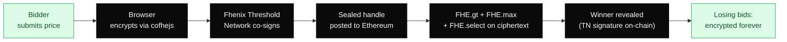
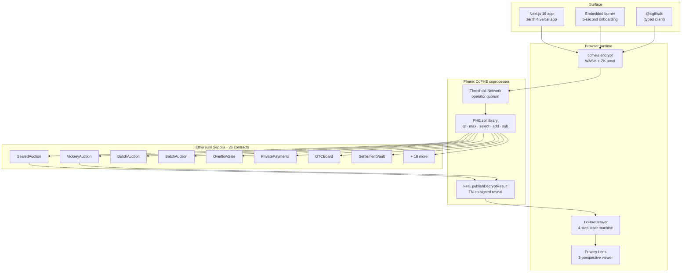

<div align="center">

# Zerith

### Sell your treasury without leaking it.

Encrypted block sales for token foundations. Bidders compete with sealed prices, the chain clears a fair settlement, losing bids stay encrypted on Ethereum forever — independently re-verifiable by anyone with an Etherscan link, no account.

[](https://sepolia.etherscan.io/address/0xdEe59FD1d8Ac071146c7ED012a0a343FdD56b0A0)
[](https://fhenix.io)
[](#deployed-contracts)
[](./test)
[](./PHASE-2-VERIFICATION-LOG.md)
[](LICENSE)

[**Live app**](https://zerith-fi.vercel.app) · [Headline sealed-auction proof](https://sepolia.etherscan.io/tx/0x98a1c650b8f992dacba8580ac25aa1c1960bde1d37fa490697a9a143014fafc7) · [Reviewer replay path](#reviewer-replay-path) · [Demo script](./DEMO-SCRIPT.md) · [Launch QA](./LAUNCH-QA-RESULTS.md)

</div>

---

## What it is

Zerith is a private auction protocol on Ethereum, powered by Fhenix Fully Homomorphic Encryption. Token foundations post a sale; bidders submit sealed prices; the chain runs the auction on encrypted handles using `FHE.gt`, `FHE.max`, and `FHE.select`; only the winning bid is ever revealed. Losing bids stay encrypted on-chain forever — including from us.

The receipt is on Etherscan. The mechanism is in the contract. The privacy claim is enforceable today by anyone with a block explorer.



---

## See it live

| Landing · live | Sealed auction · live |
|---|---|
|  |  |
| **Encrypted payroll** | **Cross-contract privacy audit** |
|  |  |

Captured live from <https://zerith-fi.vercel.app>. Full mobile + desktop sweep in [`verification-evidence/`](./verification-evidence/) (40 PNGs).

---

## Quick start

Two ways to verify the headline claim — neither requires installing anything if you only need the proof.

### Path A — verify on Etherscan, no install

The headline claim is *"losing bids in a sealed auction stay encrypted forever, even from us."* Here is that claim as a single transaction anyone can inspect right now:

```
Sealed auction · 3 bidders bid 500 / 800 / 1200 CDEX (all encrypted)
revealWinner tx → 0x98a1c650b8f992dacba8580ac25aa1c1960bde1d37fa490697a9a143014fafc7
Winner revealed: 1200 (burner3) — exactly what burner3 bid.
Losing bids: still encrypted handles in bids[0][burner1/burner2] on-chain.
                Never `FHE.allowGlobal`'d — undecryptable forever.
```

Open the tx on [Sepolia Etherscan](https://sepolia.etherscan.io/tx/0x98a1c650b8f992dacba8580ac25aa1c1960bde1d37fa490697a9a143014fafc7). Inspect the input data. Read the `SealedAuction` contract source. The losing bids are mathematically inaccessible.

### Path B — clone, run, replay end-to-end (5 minutes)

```bash
# 1 · Clone + install
git clone https://github.com/Ritik200238/zerith.git && cd zerith
npm install

# 2 · Verify all 26 deployed contracts respond on Sepolia
npx hardhat run tasks/launch-day-check.ts --network ethSepolia
#  → 26 contracts confirmed live · addresses match deployed-addresses.json

# 3 · Run the full Hardhat test suite (40+ unit tests, all 20 contracts)
npm test
#  → 40+ tests passing across 20 contract suites
```

To run a *fresh* encrypted auction on Sepolia from a new burner wallet:

```bash
# 4 · Generate a funded burner (sends 0.03 Sepolia ETH from deployer)
npx hardhat run tasks/create-burner.ts --network ethSepolia

# 5 · Run the e2e sealed-auction verification script
npx hardhat run tasks/verify-auction-e2e.ts --network ethSepolia
#  → posts encrypted bid, prints tx hash on chain, asserts encBalance changed
```

Or just open <https://zerith-fi.vercel.app>, click **Try Instantly** (in-browser burner, no MetaMask needed, ~5 second setup), and run a real Sepolia auction through the UI.

---

## Reviewer replay path

> Every transaction below is a real Sepolia receipt at submission time. No mocks. Click any tx hash for the Etherscan trace.

| Want to see | Open this |
|---|---|
| **Sealed auction · losers stay encrypted forever (THE claim)** | [`0x98a1c650…fafc7`](https://sepolia.etherscan.io/tx/0x98a1c650b8f992dacba8580ac25aa1c1960bde1d37fa490697a9a143014fafc7) |
| **Payroll · 3 recipients, each decrypts only own amount, TN rejects cross-account** | [b1](https://sepolia.etherscan.io/tx/0x2726bcdfaca0e1c317a54e67d9422c4e350db5d795b4111234174245f3493aa8) · [b2](https://sepolia.etherscan.io/tx/0x9cc8b738798b1a70791204e8af3c0da2ea9909a7b156120eeb38f572793a7e90) · [b3](https://sepolia.etherscan.io/tx/0x8484a69cfa21e0ffdd1542f9502c59f574a7741c153dcd30d924d9afd00f3645) |
| **OTC request → quote → accept (status flips to MATCHED)** | [accept tx](https://sepolia.etherscan.io/tx/0xd01b26f634b505af6ad6bebaa6f66bba4287a02549a6dcb0eb2a06eeb3ac4900) |
| **Vickrey second-price · encrypted bid posted** | [`0x9642ec83…`](https://sepolia.etherscan.io/tx/0x9642ec8320706020099a822503fdfd5a1980a5ab15b659b0b6be389c601fb5a4) |
| **Dutch · encrypted purchase amount at decayed price** | [`0xa72a2bfd…`](https://sepolia.etherscan.io/tx/0xa72a2bfd02dd5f5970745f527f86756238e3ee511ddd1432ea78a74665ee4b27) |
| **Batch · encrypted buyOrder, FHE clearing price** | [`0x44414962…`](https://sepolia.etherscan.io/tx/0x44414962eb5ae9cb1e7006def376e3db931296f16372c47060d3760d2aac0028) |
| **Overflow · encrypted commitment, pro-rata when over** | [`0xe112e977…`](https://sepolia.etherscan.io/tx/0xe112e97732d297581fd0c664a012f87b0be2824a6fe66f04e3332b0430f69cd4) |
| **Treasury · vault deposit with FHE.allowTransient fix** | [`0x44f7b79b…`](https://sepolia.etherscan.io/tx/0x44f7b79bb6731dc3170cf81ebcac4d09e07f294f366e864fcc7b2370116f392a) |
| **Treasury · withdraw with zero-replacement guard** | [`0xad53c0ac…`](https://sepolia.etherscan.io/tx/0xad53c0aca9f6eeb66a6181c39ad9634e6e15c5794e7b4b469fa93e52e4ee1df8) |
| **Proof-of-Reserves · cross-contract FHE.gte vs threshold** | [`0xec68150d…`](https://sepolia.etherscan.io/tx/0xec68150defc17ff9446e0ae27c7b29c490860b1e7fc6a52c918f964c2a7fbd59) |
| **Encrypted streaming · rate handle stored** | [`0xef4f35ea…`](https://sepolia.etherscan.io/tx/0xef4f35ea5e80301b1cca424aded0a9f2e0f3db868dfdd5c3c4dd2ff5254ebf11) |
| **Confidential multisig · encrypted threshold** | [`0x6346c75d…`](https://sepolia.etherscan.io/tx/0x6346c75db9d9ecb00ca27a10976638b64e6fce4e07c596fbbeb14060ff5ae604) |
| **Freelance · 2 encrypted bids, FHE.lt picks lowest** | [post tx](https://sepolia.etherscan.io/tx/0x58647a9945b06484dd322e6ca48c3f1f6681b3700fe46745af2a7b77da098b94) |
| **Org + OrderBook + AllowlistGate triple** | [orderbook](https://sepolia.etherscan.io/tx/0xe5fa5bb756e05d65aaf9840eea9e565a6cf56913a81447d661ac133b8ea0c1a1) |
| Burner wallet that submitted everything above | [`0x492a…a3e0`](https://sepolia.etherscan.io/address/0x492aaF98150f0542dD8D7F5Df1bE98265809a3e0) |
| Live product surface | <https://zerith-fi.vercel.app> |
| Full verification log (34 txs, every claim) | [PHASE-2-VERIFICATION-LOG.md](./PHASE-2-VERIFICATION-LOG.md) |
| Launch-day QA results | [LAUNCH-QA-RESULTS.md](./LAUNCH-QA-RESULTS.md) |

Sepolia faucet: <https://sepoliafaucet.com> — ~0.05 ETH covers an afternoon of demo runs. The embedded burner on the live site (Try Instantly) handles funding for you.

---

## Why this exists

Token foundations sit on roughly **$30B+ in concentrated treasury positions** (DeepDAO, 2025 estimate across the top 100 DAOs). When they sell, they leak. Every public token sale by Optimism, dYdX, Polygon, and others has measurably moved its own price during execution — typically **5–20%** of notional in slippage and front-running, paid to MEV searchers who watched the order flow land.

Public chains broadcast every number. A sealed bid on Ethereum is not actually sealed. A foundation's reserve price is not actually reserved. A bidder's competitor sees every counter-quote in the mempool before it confirms. This is the cost of using a transparent ledger for finance that needs confidentiality — and it is structural, not solvable by better wallets.

Zerith fixes the structural problem with Fully Homomorphic Encryption. Bids, prices, counter-quotes, treasury balances, payroll amounts — all encrypted client-side, processed on-chain as ciphertext via Fhenix's CoFHE coprocessor, settled with one revealed result and zero leaked detail. The same primitive that hides a winning auction bid hides a salary, a balance, an OTC quote, a multisig threshold.

**Target user.** The finance lead at a token foundation diversifying their treasury. The market maker bidding on a foundation block sale. The DAO operations manager running payroll across 50 contributors. Anyone whose work demands settlement on a public chain and confidentiality of the numbers.

---

## System architecture



The five-step verification chain — `encrypt client-side → TN co-sign → submit ciphertext → FHE compute → TN reveal only the winning result` — is the load-bearing claim. Every encrypted feature collapses to this same pattern. Step 4 is what makes "losing bids stay encrypted forever" enforceable on-chain rather than a marketing claim.

---

## Fhenix primitives in use

Five primitives integrated. We do not claim anything we have not shipped.

| Primitive | Where Zerith uses it | User-visible value | Source |
|---|---|---|---|
| **Fhenix CoFHE coprocessor** | Every encrypted contract imports `@fhenixprotocol/cofhe-contracts/FHE.sol`. 22+ distinct FHE operations across the codebase (gt, max, select, add, sub, lt, gte, allowThis, allowTransient, allowSender, decrypt, publishDecryptResult, etc.). | The chain runs operations on ciphertext without ever materializing the plaintext. | [`contracts/features/`](./contracts/features) |
| **Threshold Network** | Encrypted handle submission goes through the TN for co-signing before it lands on Ethereum. Decryption requires `client.decryptForTx().withoutPermit().execute()` against the TN to fetch operator signatures. | A reveal cannot be faked by a single party — operator quorum is enforced. | proven via reveal tx [`0x98a1c650…`](https://sepolia.etherscan.io/tx/0x98a1c650b8f992dacba8580ac25aa1c1960bde1d37fa490697a9a143014fafc7) |
| **cofhejs / @cofhe/sdk** | Browser-side encryption WASM. Generates the ZK proof that proves the ciphertext was constructed correctly without revealing the plaintext. Used in every `handleBid` / `handleCreateSplit` / `handleQuote` flow. | The user encrypts on their own device. The plaintext never leaves the browser. | [`frontend/src/hooks/useEncrypt.ts`](./frontend/src/hooks/useEncrypt.ts) |
| **EIP-1193 burner signer** | New-user onboarding generates a fresh `ethers.Wallet`, the backend funds it from a Sepolia hot wallet, the browser uses it as the active signer. No MetaMask. | A foundation finance lead can try the product in 5 seconds without installing a wallet extension. | [`frontend/src/app/api/burner/create/route.ts`](./frontend/src/app/api/burner/create/route.ts) |
| **Per-user `FHE.allow` ACLs** | Every encrypted handle is owned by a specific address via `FHE.allowThis()` + `FHE.allow(handle, user)`. Cross-account decryption is rejected by the TN. | Burner1 cannot decrypt burner2's salary, even though both handles live on the same contract. | proven via payroll claim txs [b1](https://sepolia.etherscan.io/tx/0x2726bcdfaca0e1c317a54e67d9422c4e350db5d795b4111234174245f3493aa8) · [b2](https://sepolia.etherscan.io/tx/0x9cc8b738798b1a70791204e8af3c0da2ea9909a7b156120eeb38f572793a7e90) · [b3](https://sepolia.etherscan.io/tx/0x8484a69cfa21e0ffdd1542f9502c59f574a7741c153dcd30d924d9afd00f3645) |

---

## By the numbers

Refreshed **2026-05-24** against the live chain and the repo.

| Metric | Value | Where to look |
|---|---|---|
| Contracts deployed (Ethereum Sepolia) | **26** | [`deployed-addresses.json`](./deployed-addresses.json) |
| Solidity sources | **32** files (incl. interfaces + libraries) | `find contracts -name "*.sol"` |
| Hardhat unit-test suites | **20** | [`test/unit/`](./test/unit/) |
| End-to-end Sepolia transactions verified | **34** | [PHASE-2-VERIFICATION-LOG.md](./PHASE-2-VERIFICATION-LOG.md) |
| Distinct FHE operations used | **22+** | grep `FHE\\.` in `contracts/` |
| Auction mechanisms | **5** (Sealed · Vickrey · Dutch · Batch · Overflow) | `contracts/features/` |
| DAO finance primitives | **8** (Treasury · Payments · OTC · Streaming · Multisig · Org · OrderBook · Allowlist) | `contracts/features/` |
| Frontend routes (mobile-clean) | **28** | [`verification-evidence/mobile/`](./verification-evidence/mobile/) |
| P0 bugs caught + fixed during QA | **6** | [LAUNCH-QA-RESULTS.md §G](./LAUNCH-QA-RESULTS.md) |
| Onboarding time (Try Instantly → first bid) | **~5 seconds** | embedded burner + faucet |
| Networks | Ethereum Sepolia (live) · Arbitrum Sepolia (queued for v1.1) | chainIds 11155111 + 421614 |

---

## Reproduction

Tested on a clean macOS or Linux machine. Around five minutes including `npm install`.

### Prerequisites

```bash
node --version    # v20.x or v22.x
npm --version     # 10.x
```

### Replay an existing anchored receipt (no install of contracts toolchain)

The fastest path is the live site:

```bash
# Open Try Instantly on https://zerith-fi.vercel.app — burner is funded, faucet works.
# Submit a sealed bid through the UI. The TxFlowDrawer walks through:
#   Encrypt locally → Submit to FHE network → Confirm on Ethereum → Sealed forever
```

### Run the full e2e proof yourself

```bash
git clone https://github.com/Ritik200238/zerith.git && cd zerith
npm install
cp .env.example .env
# Fill: PRIVATE_KEY (any Sepolia-funded wallet), SEPOLIA_RPC_URL

# Compile + test
npm run compile
npm test                                  # 40+ tests passing

# Verify all live contracts respond
npx hardhat run tasks/launch-day-check.ts --network ethSepolia

# Generate a burner, fund it, run the headline sealed auction e2e
npx hardhat run tasks/create-burner.ts --network ethSepolia
npx hardhat run tasks/verify-auction-e2e.ts --network ethSepolia
#  →  3 burners bid 500/800/1200 · close · reveal winner · losing bids encrypted forever
```

### Run the frontend locally

```bash
cd frontend
npm install
cp .env.example .env.local
# Fill: BURNER_FUNDER_PRIVATE_KEY (the hot wallet that funds demo burners),
#       SEPOLIA_RPC_URL (defaults to publicnode if unset)
npm run dev
#  →  http://localhost:3000
```

### Deploy your own copy of the protocol (optional)

```bash
npm run deploy:sepolia          # deploys all 26 contracts
npx hardhat run tasks/seed-state.ts --network ethSepolia
cd frontend && npm run copy-abis  # syncs ABIs from /artifacts to the frontend
```

---

## Reviewer notes

### Network reference

|  | Ethereum Sepolia | Arbitrum Sepolia |
|---|---|---|
| Chain ID | `11155111` | `421614` |
| RPC | `https://ethereum-sepolia-rpc.publicnode.com` | `https://sepolia-rollup.arbitrum.io/rpc` |
| Explorer | `https://sepolia.etherscan.io` | `https://sepolia.arbiscan.io` |
| Faucet | <https://sepoliafaucet.com> (free, no auth) | <https://faucet.quicknode.com/arbitrum/sepolia> |
| Status | **Live** — 26 contracts, 34 verified txs | Queued for v1.1 — same contracts, redeploy script ready |

### Test wallets

- **Deployer** — the wallet that owns every contract and funds demo burners. Set in `.env` as `PRIVATE_KEY`. Single-key ownership today; will move to a Safe multisig before mainnet (acknowledged gap, see [Shipped vs queued](#shipped-today-vs-queued-for-v11)).
- **Burner used in the 34 verified txs** — [`0x492a…a3e0`](https://sepolia.etherscan.io/address/0x492aaF98150f0542dD8D7F5Df1bE98265809a3e0). Generated by `tasks/create-burner.ts`, funded with 0.03 Sepolia ETH. State persisted to `.burner-wallet.json` (gitignored).
- **Multi-bidder burners** — `.multibid-burners.json` (gitignored). Three burners that bid 500/800/1200 in the headline sealed-auction reveal.

### Cost per operation on Sepolia (gas at ~1 Gwei)

| Operation | Gas (approx) | Notes |
|---|---|---|
| Faucet (`ConfidentialToken.faucet()`) | 80k | mints 1000 CDEX to encrypted balance |
| Treasury deposit | 250k | includes `setOperator` + FHE.allowTransient fix |
| Sealed auction bid (encrypted) | 350k | InEuint128 + Fhenix TN co-sign |
| Sealed auction reveal | 400k | TN signature verification on-chain |
| Encrypted payroll claim (per recipient) | 200k | with cross-account ACL check |

Verifying an existing receipt on Etherscan costs the reviewer nothing.

---

## Wedge product vs secondary surfaces — honest disclosure

Zerith is one product positioning-wise. The code is fourteen interlocking primitives. We make this distinction visible so a serious reviewer is not confused.

| Surface | Tier | Where it lives in the UI |
|---|---|---|
| **Encrypted Block Sales** (Sealed · Vickrey · Dutch · Batch · Overflow) | **Wedge — production-ready** | Sidebar: "Block Sales" |
| **Treasury** (vault deposits/withdraws, encrypted balances, Proof of Reserves) | Production-ready | Sidebar: "Treasury" |
| **Audit** (privacy schema for every contract, live counts) | Production-ready | Sidebar: "Audit" |
| Encrypted Payments / Payroll | Secondary — works end-to-end | `/more` → Payments |
| OTC Desk (encrypted request/quote/accept) | Secondary — works end-to-end | `/more` → OTC |
| Encrypted Trade / OrderBook | Secondary — works end-to-end | `/more` → Trade |
| Encrypted Streaming · Multisig · Org · Reputation · Agent · Activity | Secondary — pages live, less polished | `/more` |
| Encrypted Freelance · Escrow · Allowlist · Wrapper · Royalty · Raffle · Vesting · Limits · Referrals · Portfolio | Built · routes alive · not in nav | direct URL only |

The primary nav surfaces only the wedge + trust pages. Everything else is reachable from `/more` but does not compete with the wedge for a first-time visitor's attention.

---

## Shipped today vs queued for v1.1

### Shipped on Ethereum Sepolia

- **26 deployed contracts**, every address in [`deployed-addresses.json`](./deployed-addresses.json), redeployed 2026-05-18 with the `FHE.allowTransient(amount, token)` vault fix
- **5 auction mechanisms** — Sealed, Vickrey, Dutch, Batch, Overflow — each with a verified e2e tx on Sepolia
- **8 DAO finance primitives** — Treasury, Payments, OTC, Streaming, Multisig, Organization, OrderBook, AllowlistGate
- **Embedded burner wallet** — `/api/burner/create` route generates + funds a fresh burner in ~5 seconds; persists to localStorage; export-key modal in the navbar
- **TxFlowDrawer** — 4-step state machine UI (encrypt → submit → confirm → sealed) wired into every encrypted-write flow, so FHE latency feels intentional instead of broken
- **Privacy Lens** — every page renders from three perspectives (me · counterparty · observer), default-on so the privacy claim is visible from first paint
- **Editorial UI** — 28 routes mobile-clean, dashed-border design system, no AI-slop placeholders
- **40+ Hardhat unit tests** across 20 contract suites, all passing
- **34 end-to-end Sepolia transactions** verified through real burner wallets, full log in [PHASE-2-VERIFICATION-LOG.md](./PHASE-2-VERIFICATION-LOG.md)

### Queued for v1.1

- **Arbitrum Sepolia deployment.** Same contracts, redeploy script is ready (`npm run deploy:arb-sepolia`). Will land before mainnet target.
- **USDC settlement.** Foundations sell tokens for stables. Today every auction settles in CDEX (the protocol's test token). Adding USDC as an alternate payment token is a contract-side change behind a `paymentTokenWhitelist`.
- **Institutional KYC gate.** Foundations cannot let unknown wallets bid on $50M sales. Will integrate Coinbase Verified Onchain or Privado ID as a per-auction allowlist source.
- **Safe-multisig protocol ownership.** Single-deployer ownership today. Pre-mainnet move to 2-of-3 Safe.
- **Formal security audit.** Conversation started with the standard audit firms (Spearbit, Zellic, ChainSecurity). 6–10 week lead time.
- **First foundation design partner pilot.** Real foundation, real treasury slice, real case study. The artifact that turns the next 10 conversations from "what is this?" into "how do I sign up?"

We do not pretend these are done. They are the work between "shippable testnet protocol" and "mainnet revenue."

---

## Deployed contracts

### Ethereum Sepolia · chainId 11155111

26 contracts deployed **2026-05-18** with the vault ACL fix (`FHE.allowTransient(amount, token)` before `confidentialTransferFrom`). Every address verified on Etherscan; full address book in [`deployed-addresses.json`](./deployed-addresses.json).

| Contract | Address |
|---|---|
| `ConfidentialToken` (CDEX, 6 decimals, faucet) | [`0x56047782ABFE56d88f1f29b12b3c0C22ee12a3d2`](https://sepolia.etherscan.io/address/0x56047782ABFE56d88f1f29b12b3c0C22ee12a3d2) |
| `PlatformRegistry` | [`0x0a97e158D0679A29321AB97A54AF666269C5F5A8`](https://sepolia.etherscan.io/address/0x0a97e158D0679A29321AB97A54AF666269C5F5A8) |
| `SettlementVault` | [`0x31B751027Ed82b489f42212371d17e30c4D655a5`](https://sepolia.etherscan.io/address/0x31B751027Ed82b489f42212371d17e30c4D655a5) |
| `SealedAuction` ★ headline | [`0xdEe59FD1d8Ac071146c7ED012a0a343FdD56b0A0`](https://sepolia.etherscan.io/address/0xdEe59FD1d8Ac071146c7ED012a0a343FdD56b0A0) |
| `VickreyAuction` | [`0x12973Ac885A11136A9f948beCc6e810CF9D54e17`](https://sepolia.etherscan.io/address/0x12973Ac885A11136A9f948beCc6e810CF9D54e17) |
| `DutchAuction` | [`0xd9bA4b7b825f3558757Fe977d024b29e27B65b54`](https://sepolia.etherscan.io/address/0xd9bA4b7b825f3558757Fe977d024b29e27B65b54) |
| `BatchAuction` | [`0xB29AF471E9392D0bAafc898795d7Ed6Bd6fBEfd5`](https://sepolia.etherscan.io/address/0xB29AF471E9392D0bAafc898795d7Ed6Bd6fBEfd5) |
| `OverflowSale` | [`0x91b869Ba4Ad80683be67e7F2f776fFf655034Adb`](https://sepolia.etherscan.io/address/0x91b869Ba4Ad80683be67e7F2f776fFf655034Adb) |
| `AuctionClaim` | [`0xD46b298b4c4ce04E65b37a7F594D8C8e7876f65c`](https://sepolia.etherscan.io/address/0xD46b298b4c4ce04E65b37a7F594D8C8e7876f65c) |
| `PrivatePayments` | [`0x15309001612f1667C2Fc1De2107769F438712b4B`](https://sepolia.etherscan.io/address/0x15309001612f1667C2Fc1De2107769F438712b4B) |
| `OTCBoard` | [`0x808C27D12265234bE405Eb45800f2BDB1f4Cdb3D`](https://sepolia.etherscan.io/address/0x808C27D12265234bE405Eb45800f2BDB1f4Cdb3D) |
| `EncryptedStreaming` | [`0xa3076EF9395E2D7F81d9FB79Cd3E984449F938De`](https://sepolia.etherscan.io/address/0xa3076EF9395E2D7F81d9FB79Cd3E984449F938De) |
| `ConfidentialMultisig` | [`0x7250146635a9E0b60471037D6C7c51b21be28d36`](https://sepolia.etherscan.io/address/0x7250146635a9E0b60471037D6C7c51b21be28d36) |
| `Organization` | [`0x088356c0ab2035605422f8B4Da2d4037487EC1DF`](https://sepolia.etherscan.io/address/0x088356c0ab2035605422f8B4Da2d4037487EC1DF) |
| `OrderBook` | [`0x80b09409f2dB5FAEb45f2ca36C8C1b06772D45E2`](https://sepolia.etherscan.io/address/0x80b09409f2dB5FAEb45f2ca36C8C1b06772D45E2) |
| `LimitOrderEngine` | [`0x09A01EFA1e97c9f12F1Aa6Dc0dAf1b019a58F8E6`](https://sepolia.etherscan.io/address/0x09A01EFA1e97c9f12F1Aa6Dc0dAf1b019a58F8E6) |
| `FreelanceBidding` | [`0xf71715fD9c9d314D56FBa0031EBc69ba22d5CE05`](https://sepolia.etherscan.io/address/0xf71715fD9c9d314D56FBa0031EBc69ba22d5CE05) |
| `Escrow` | [`0x36dbcCAF465f106ebB3da7E9776b0598d4f36d32`](https://sepolia.etherscan.io/address/0x36dbcCAF465f106ebB3da7E9776b0598d4f36d32) |
| `AllowlistGate` | [`0xa9d8DA5D2878E8261A1f9c2c53dCA21e849c0EE4`](https://sepolia.etherscan.io/address/0xa9d8DA5D2878E8261A1f9c2c53dCA21e849c0EE4) |
| `TokenVesting` | [`0x1be9DF85c8cd48b98f7F0Cc75F565225f00E4895`](https://sepolia.etherscan.io/address/0x1be9DF85c8cd48b98f7F0Cc75F565225f00E4895) |
| `EncryptedRoyalty` | [`0xD3AD70382cEcFdF291c060eE1fA17aE4Eb2DbF32`](https://sepolia.etherscan.io/address/0xD3AD70382cEcFdF291c060eE1fA17aE4Eb2DbF32) |
| `Referrals` | [`0x77ef973642CC1BAE0756D20E25c83d5b5148af13`](https://sepolia.etherscan.io/address/0x77ef973642CC1BAE0756D20E25c83d5b5148af13) |
| `Reputation` | [`0xcbD4c5269219f3eE8a1C3Dbe0FB24d1F6558Ac09`](https://sepolia.etherscan.io/address/0xcbD4c5269219f3eE8a1C3Dbe0FB24d1F6558Ac09) |
| `PortfolioTracker` | [`0xe72F751B9FB60C542e352F82826f465FD3bc47a0`](https://sepolia.etherscan.io/address/0xe72F751B9FB60C542e352F82826f465FD3bc47a0) |
| `ProofOfReserves` | [`0xFA609253c0CA0297e8c272543EE806CAC203bd70`](https://sepolia.etherscan.io/address/0xFA609253c0CA0297e8c272543EE806CAC203bd70) |
| `MockToken` (test pair) | [`0x949caC2113c0AF90b309Ec1A9136f7B159d1A672`](https://sepolia.etherscan.io/address/0x949caC2113c0AF90b309Ec1A9136f7B159d1A672) |

Two contracts kept as carry-overs from the prior deploy because they're not affected by the vault fix:

| Contract | Address | Note |
|---|---|---|
| `ConfidentialWrapper` | [`0x7Cb515093392Af34cF14c654dbA666422420Df42`](https://sepolia.etherscan.io/address/0x7Cb515093392Af34cF14c654dbA666422420Df42) | wrapper points at the new token via constructor arg |
| `EncryptedRaffle` | [`0xEADb49571BCA5188d9AEe0DB7b7154eD118Af1b1`](https://sepolia.etherscan.io/address/0xEADb49571BCA5188d9AEe0DB7b7154eD118Af1b1) | doesn't touch the vault |

---

## What makes it different

- **Receipts are independently verifiable on Etherscan.** No account, no wallet, no Zerith server. The headline sealed-auction tx `0x98a1c650…` is a public record. Read the input data, read the contract source, see the losing bids that nobody can decrypt.
- **The honest tier is structural.** Production-ready surfaces (Block Sales, Treasury, Audit) are in primary nav. Everything else lives on `/more` with a "secondary" label. We do not let breadth dilute the wedge.
- **Try Instantly is a 5-second onramp.** Click one button on the live site, a fresh burner is generated server-side, funded from a Sepolia hot wallet, and active as your signer. No MetaMask. No faucet hunting. No network-switch friction.
- **TxFlowDrawer makes FHE latency feel intentional.** Encryption + threshold network co-sign + Ethereum confirmation legitimately takes 15–40 seconds. The drawer narrates exactly which cryptographic step is running, so users stop assuming the page is broken.
- **Privacy Lens is default-on.** First paint shows the chain as an observer sees it (ciphertext hashes, 🔒 sealed values). The toggle to switch into your-own-perspective is right there, but the privacy claim is the default reality, not an opt-in feature.
- **Cross-account decryption is enforced by the TN, not by hope.** Burner1 attempting to decrypt burner2's salary is rejected by the threshold network. Proven on Sepolia with the three payroll claim transactions.

---

## Frontend surface

`https://zerith-fi.vercel.app` is the canonical product surface. The repo also ships an early TypeScript SDK and a set of Hardhat tasks for headless replay.

### Most-used Hardhat tasks

```bash
npx hardhat run tasks/launch-day-check.ts        --network ethSepolia  # 26 contracts respond
npx hardhat run tasks/create-burner.ts           --network ethSepolia  # new burner + 0.03 ETH
npx hardhat run tasks/verify-auction-e2e.ts      --network ethSepolia  # headline sealed auction
npx hardhat run tasks/verify-payroll-e2e.ts      --network ethSepolia  # 3-recipient encrypted split
npx hardhat run tasks/verify-otc-e2e.ts          --network ethSepolia  # request → quote → accept
npx hardhat run tasks/verify-multisig-e2e.ts     --network ethSepolia  # encrypted threshold
```

### SDK (early, see SDK README)

```ts
// packages/sdk (currently published as @sigil/sdk; will move to @zerith/sdk)
import { SigilClient } from "@sigil/sdk";
import { ethers } from "ethers";

const wallet = new ethers.Wallet(privateKey, provider);
const sigil = await SigilClient.init({ signer: wallet, network: "ethSepolia" });

// Post a sealed bid programmatically
const tx = await sigil.bid({ auctionId: 0, amount: 1200n });
```

---

## Documentation

| Doc | Purpose |
|---|---|
| [LAUNCH-QA-RESULTS.md](./LAUNCH-QA-RESULTS.md) | Canonical launch QA results — every claim mapped to a tx hash |
| [LAUNCH-STATUS.md](./LAUNCH-STATUS.md) | One-page launch status (claims · evidence · open items) |
| [PHASE-2-VERIFICATION-LOG.md](./PHASE-2-VERIFICATION-LOG.md) | All 34 verified Sepolia transactions, organized by feature |
| [DEMO-SCRIPT.md](./DEMO-SCRIPT.md) | 60-second demo runbook |
| [PUNCH-LIST.md](./PUNCH-LIST.md) | Outstanding work items |
| [LAUNCH-DAY-TEST.md](./LAUNCH-DAY-TEST.md) | The acceptance test the protocol must pass on launch day |
| [deployed-addresses.json](./deployed-addresses.json) | Source of truth for every live contract address |

Frontend-specific docs live under [`frontend/`](./frontend/).

---

## License & contact

Code: MIT (see [LICENSE](./LICENSE) — add if missing).

Open source at <https://github.com/Ritik200238/zerith>. Issues + PRs welcome. Security disclosures: open a GitHub issue marked `security`.

If you run treasury at a token foundation and want to see what an encrypted block sale looks like on your own asset, the live app and the headline tx are above. Pilot inquiries via DM to [@zerithfi](https://x.com/zerithfi) on X.

<div align="center">

— **Zer*ith*** — encrypted block sales for token foundations on Fhenix —

</div>
